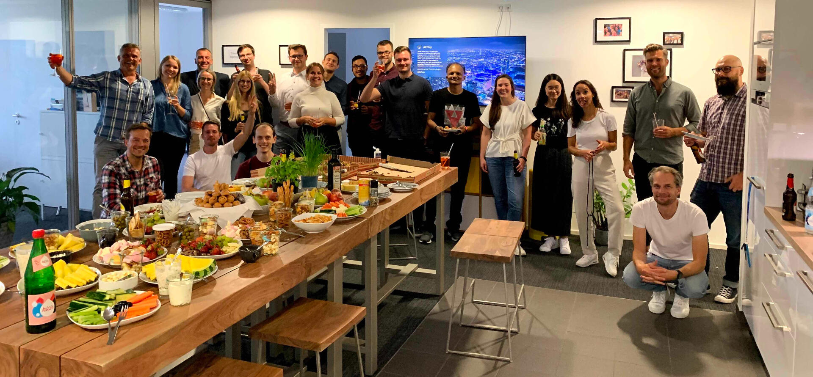
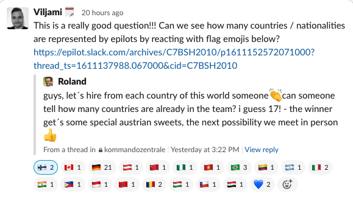
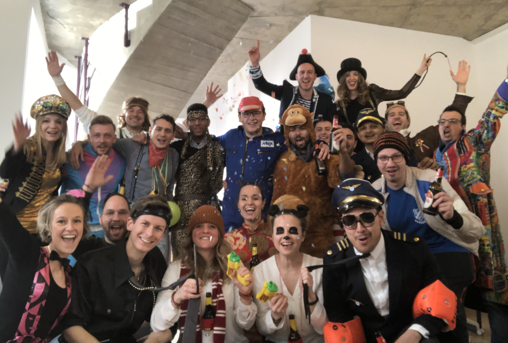

<h1 align="center">Jobs at epilot</h1>

## 🦄 Who we are 

We are epilot, an innovative global scale-up from Cologne.
Come build the leading ecosystem for energy ecommerce with us!

Founded in 2017, go-live of our app in 2018. Our vision is that companies can sell even complex products online as easily as a pair of shoes.

In the end of 2020  we were already 80+ epilots (that´s how we like to call ourselves)  working on our common vision - number still counting. To date our app is already helping 75+ customers from the energy market to make their lives easier selling their complex energy products online. Even though the energy market is our starting point, our long term vision is much broader: we want to enable companies from any markets to sell their complex products with our app (e.g. insurance, real-estate etc.) as easy as a pair of shoes online. 

Our key to success? We build on a founders team with a decade on expertise in growing successful businesses, a bunch of experts from software engineering, product management and sales, a great product-market fit and reputable shareholders. But most important: in the end it is of course all the talented people at epilot and the great teamspirit which makes epilot a great company - both for our employees and our customers.

To further scale our product we are constantly looking for exceptional talents to join our team!

Already courious? Check out [epilot.cloud/en/career](https://epilot.cloud/en/career/) for our open vacancies! Want to find out more? Read on!

##  📚 Further readings 

<!-- toc -->

- [Remote first](#-remote-first)
- [Our tech stack](#-our-tech-stack)
- [More reasons to join](#-more-reasons-to-join)
- [How to get hired at epilot ](#-how-to-get-hired-at-epilot)
- [Even more to read](#-even-more-to-read)
- [Contact](#-contact)

<!-- tocstop -->

## 🌎 Remote first 

Even though our HQ is based in Cologne (Germany), we offer fully remote opportunities. But if you don´t want to miss out our cozy office enviroment, we are also happy to support relocation to Cologne.

We know Cologne is not Berlin, Hamburg or Munich - Cologne is even better! If you are tired of crowded places like Berlin and looking for a good mixture of big city vibes and small town coziness, then you should definitetly give [Cologne](https://www.cologne-tourism.com/) a try! 😉

## 🖥 Our tech stack

Our app is running on AWS and we are currently taking our monolithic application apart into microservices. Our focus on the technology side is moving towards serverless applications (e.g. powered by AWS API gateway, SNS, SQS, Lambda, DynamoDB, etc.) built in React/JavaScript and TypeScript. 

If you want to learn more about our tech stack you can review our tech stack at [techradar.epilot.io](https://techradar.epilot.io/index.html?sheetId=https%3A%2F%2Ftechradar.epilot.io%2Fradar.csv)

And if you want to learn more about our engineering principles check this out: https://github.com/epilot-dev/engineering-principles

## 🤩 More reasons to join

There are plenty good reasons to join epilot. Looking at the engineering side there is  great potential to set trajectory in terms of technology, while taking advantage of a modern tech stack. Since we are a SaaS company, working in software developement means working on the core of our business and having a meaningful impact on the growth of our fast growing scale up. 

From the people side you can expect working along with highly motivated and talented people with diverse professional and personal background. As developer you will work in multidisciplinary product squads and subscribe to agile methodologies. As human being you will get in touch with awesome people from 18+ nationalities. 

If you need more reasons to join feel free to check out our promise to all employees at [promise.epilot.cloud](https://promise.epilot.cloud) 

## 🚀 How to get hired at epilot

You want to know what to expect from our hiring process? Check out the step-by-step guide on ["How to get hired at epilot"](https://dev.to/epilot/how-to-get-hired-at-epilot-step-by-step-guide-4ei1) on dev.to

In short you can expect the steps shown in the illustration below:

## 🤓 Even more to read

Want to learn more about epilot? Check out our website: [epilot.cloud](https://epilot.cloud) 

To get more insights on tech topics but also people topics check out our blog at dev.to:[dev.to/epilot](https://dev.to/epilot) 

For most recent updates on our product and business check out and follow our LinkedIn profile (sorry mostly in 🇩🇪 German since our main audience is from 🇩🇪):[epilot LinkedIn-Profile](https://www.linkedin.com/company/epilot/) 

If you didn´t take a look at our promise page already mentioned above - here we go: [promise.epilot.cloud](https://promise.epilot.cloud) 

## 📧 Contact 

Need more information or just want to reach out directly to us? 

Contact us at: [careers@epilot.cloud](mailto:careers@epilot.cloud)

We are looking forward to welcome new epilots to join our crew!

